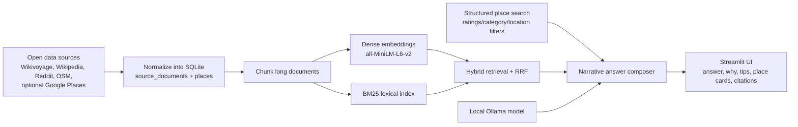
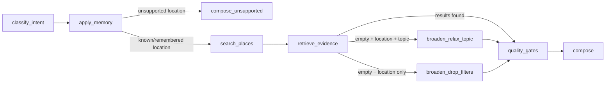

# LocalLens

A local-first RAG assistant for travelers and recent movers. Ask questions like:

- `What should I know before moving to Seattle?`
- `Where is a good sunset spot in San Francisco?`
- `Best taco place in San Jose over 4.5?`
- `Can I rely on public transit in Chicago?`

LocalLens combines open travel guides, local forum threads, structured place records, and optional Google Places enrichment to answer questions with cited, narrative responses.

---

## Architecture



---

## Data Sources

**Default open-source pipeline:**

- `Wikivoyage` — sectioned city/park guide content for activities, transit, food, safety, lodging
- `Wikipedia` — summaries and thumbnail images for orientation and visual context
- `Reddit` — city-subreddit travel/local threads with top comments
- `OpenStreetMap / Overpass` — structured places for restaurants, parks, museums, attractions, hotels, viewpoints, and transit nodes

**Optional enrichment:**

- `Google Places API` — live ratings, review counts, and place metadata
- `NPS API` — national-park metadata

---

## Project Layout

```text
LocalLens/
├── app.py
├── artifacts/
├── data/
│   ├── processed/
│   └── raw/
├── docs/
├── scripts/
├── src/locallens/
├── .env.example
├── Dockerfile
├── docker-compose.yml
└── requirements.txt
```

---

## Quickstart

### 1. Install

```bash
cd LocalLens
python3 -m venv .venv
source .venv/bin/activate
python3 -m pip install --upgrade pip
python3 -m pip install -r requirements.txt
```

### 2. Configure environment

```bash
cp .env.example .env
```

The `.env.example` file includes all required values — no API keys needed to get started.

### 3. Build the corpus (first run only)

`data/processed/` and `artifacts/` are gitignored, so a fresh checkout has no SQLite database or
embeddings yet:

```bash
python scripts/build_corpus.py
python scripts/build_index.py
```

### 4. Run the app

```bash
PYTHONPATH=src streamlit run app.py
```

---

## Local Model Setup

LocalLens uses a local generation model served through Ollama.

```bash
ollama pull llama3.1:8b-instruct-q4_K_M
ollama serve
```

Retrieval embeddings and reranking run locally via:

- `sentence-transformers/all-MiniLM-L6-v2`
- `cross-encoder/ms-marco-MiniLM-L-6-v2`

---

## Embeddings & Caching

Dense retrieval uses `sentence-transformers/all-MiniLM-L6-v2`: a small (384-dim), CPU-friendly
sentence embedding model. For short travel/place passages this gives a good latency/quality
tradeoff for a local-first app -- it runs fast enough for interactive queries on a laptop or a
small Compute Engine VM without a GPU, at some cost in embedding quality versus a larger model
like `bge-large` or an API-based embedding service.

Embeddings are cached, not recomputed on every run. `retrieval/dense.py` writes the embedding
matrix (`artifacts/chunk_embeddings.npy`) alongside a manifest (`artifacts/chunk_ids.json`)
recording the exact chunk IDs and backend used to build it. On startup, `_load_cached_matrix`
only reuses the cached matrix when the chunk set and backend name match exactly; otherwise it
re-encodes from scratch. This makes `rebuild_assets()` cheap when the corpus hasn't changed and
correct (no stale embeddings) when it has. Cache hits/misses are logged at debug level.

---

## Guardrails & Fallbacks

LocalLens is designed to say "I don't know" rather than hallucinate when it lacks evidence:

- **Unsupported location**: if a query names a place outside LocalLens's city/park catalog
  (`_unsupported_requested_location` in `service.py`), it returns a dedicated response explaining
  the corpus-coverage limit instead of guessing, with `filters_applied.coverage == "unsupported"`.
- **No grounded evidence**: if retrieval and structured place search both come back empty (or fail
  topic-specific quality gates such as `_has_high_signal_local_evidence`), `compose_answer` returns
  a plain "could not find enough grounded evidence" response with zero citations and zero place
  cards, rather than fabricating one.
- **LLM grounding checks**: even when the local Ollama model is available and produces an answer,
  `_passes_grounding_checks` in `generation/answer.py` rejects any generated answer that references
  a location outside the retrieved evidence or fails to mention the top place candidates, falling
  back to the deterministic rule-based composer instead.

See `tests/test_service.py::test_guardrail_flags_unsupported_location` and
`::test_fallback_when_no_evidence_is_grounded_but_empty` for regression coverage of these paths.

---

## Agent Orchestration & Memory

`src/locallens/agent/graph.py` compiles a [LangGraph](https://github.com/langchain-ai/langgraph)
`StateGraph` that runs the answer pipeline as explicit, named steps instead of one inline
procedure: `classify_intent -> apply_memory -> search_places -> retrieve_evidence ->
decide_followup (broaden the search if the first attempt came back empty) -> quality_gates ->
compose`. `src/locallens/agent/memory.py` adds session-scoped `ConversationMemory` so a follow-up
query like "What about good coffee?" inherits the city established earlier in the same session
(`session_id`) without the caller re-specifying it.



---

## API, Testing & CI

LocalLens is callable as a service, not just a Streamlit UI:

```bash
PYTHONPATH=src uvicorn locallens.api:app --reload
curl -X POST http://127.0.0.1:8000/answer -H 'content-type: application/json' \
  -d '{"query": "Best taco place in San Jose over 4.5?"}'
```

`tests/` covers the service, the agent graph, and the API (via FastAPI's `TestClient`) against a
small, real, checked-in fixture corpus (`tests/fixtures/`, built by
`tests/fixtures/build_fixture_corpus.py`) so the suite runs offline and deterministically:

```bash
PYTHONPATH=src pytest -q
```

`scripts/run_eval.py` scores a fixed set of queries (grounding + keyword coverage) and exits
non-zero if the aggregate score drops below a threshold, which `.github/workflows/ci.yml` runs on
every push/PR alongside the test suite.

---

## Docker

```bash
# Build
docker build -t locallens .

# Run
docker run --rm -p 8501:8501 \
  -e OLLAMA_BASE_URL=http://host.docker.internal:11434 \
  locallens

# Or with Compose
docker compose up --build
```

---

## Deployment

LocalLens is deployed on a GCP Compute Engine VM with Ollama running on the same instance.

---

## Google Places Support

LocalLens integrates with the Google Places API to enable rating-aware search (e.g. `best taco place in San Jose over 4.5 stars`).

---

## Project Files

| Path | Description |
|------|-------------|
| `data/processed/locallens.db` | Main SQLite database |
| `artifacts/chunk_embeddings.npy` | Dense embedding index |
| `src/locallens/ingestion/` | All ingestion code |

---

## Documentation

- [Project writeup](docs/WriteupLocalLens.pdf)
- [Demo script](docs/demo_script.md)
- [GCP setup notes](docs/gcp_free_tier.md)
